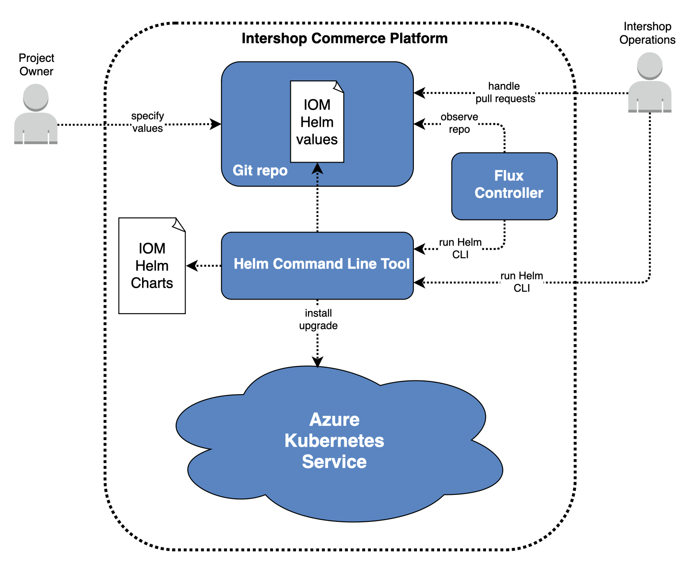

+-----------------+-------------------------+
|`^ Up            |`Next >                  |
|<../README.rst>`_|<ExampleDemo.rst>`_      |
+-----------------+-------------------------+

================================================
Helm Charts for Intershop Order Management (IOM)
================================================

----------------
Tools & Concepts
----------------

In order to understand this document, it is essential to know some basic tools and concepts. It is not the goal of this document to teach you all these tools and concepts. However, it is intended to provide an insight into how these tools and concepts are used in the context of Intershop Order Management.

Kubernetes
==========

Kubernetes is an open-source container-orchestration system for automating computer application deployment, scaling, and management. Many cloud services offer a Kubernetes-based platform or infrastructure as a service (PaaS or IaaS) on which Kubernetes can be deployed as a platform-providing service. Many vendors also provide their own branded Kubernetes distributions. (https://en.wikipedia.org/wiki/Kubernetes).

Since Kubernetes is a standard for cloud operations, using it for IOM promises the best compatibility with a wide range of cloud providers. Nevertheless, functionality is guaranteed for Microsoft Azure Kubernetes service as part of the Intershop Commerce Platform only. You can use other environments at your own risk.

A full description of Kubernetes can be found at https://kubernetes.io/docs/home/.

Kubectl
=======

Kubectl is a command-line interface to control Kubernetes clusters. It is part of Kubernetes, see https://kubernetes.io/docs/reference/kubectl/overview/.

Since it is a client which runs on the machine used to control the Kubernetes-cluster, it has to be installed separately. For this reason, it is listed as a separate tool. In the narrow sense, it is not required to operate IOM, but it is used by `Example: local Demo running in Docker-Desktop <ExampleDemo.rst>`_ and `Example: Production System in AKS <ExampleProd.rst>`_, to view the status of Kubernetes-objects.

Helm
====

Helm (https://helm.sh) sits on top of Kubernetes. Helm is a tool to manage the life cycle (install, upgrade, rollback, uninstall) of complex Kubernetes applications. To do so, it enables the development and provision of so-called Helm charts, which are basically descriptions of Kubernetes objects, combined by a template- and scripting-language.

IOM Docker Images
=================

IOM is provided in the form of Docker images. These images can be used directly, as shown in section Examples of this document, or can be the base for further customization in the context of projects.

The images are available at:

* docker.tools.intershop.com/iom/intershophub/iom-dbaccount:1.4.0
* docker.tools.intershop.com/iom/intershophub/iom:4.0.0

.. note:: Adapt the tag (version number) if you use a newer version of IOM. For a full list of available versions see `Overview - IOM Public Release Notes <https://support.intershop.com/kb/283D59>`_.

*docker.tools.intershop.com* is a private Docker registry. Private Docker registries require authentication and sufficient rights to pull images from them. The according authentication data can be passed in a Kubernetes secret object, which has to be set using the Helm parameter *imagePullSecrets*.

The document `Pull an Image from a Private Registry <https://kubernetes.io/docs/tasks/configure-pod-container/pull-image-private-registry/>`_ from Kubernetes documentation explains in general how to create Kubernetes secret objects, suitable to authenticate at a private Docker registry. `Pull images from an Azure container registry to a Kubernetes cluster <https://docs.microsoft.com/en-us/azure/container-registry/container-registry-auth-kubernetes>`_ from Microsoft Azure documentation explains how to apply this concept to private Azure container registries.

The following box shows an example of how to create a Kubernetes secret to be used to access the private Docker registry *docker.tools.intershop.com*. The name of the newly created secret is *intershop-pull-secret*, which has to be passed to Helm parameter *imagePullSecrets*. It has to reside within the same Kubernetes namespace as the IOM cluster which uses the secret.

.. code-block:: shell

  kubectl create secret docker-registry intershop-pull-secret \
      --docker-server=docker.tools.intershop.com \
      --docker-username='<user name>' \
      --docker-password='<password>' \
      -n <kubernetes namespace>	

IOM Helm-Charts
===============

IOM Helm-charts is a package containing the description of all Kubernetes-objects required to run IOM in Kubernetes. IOM Helm-charts are provided by Intershop at https://intershop.github.io/helm-charts. To use IOM Helm-charts, you have to execute the following commands:

.. code-block:: shell

  # Add all Intershop charts
  helm repo add intershop https://intershop.github.io/helm-charts
  helm repo update

  # Now the repo can be used to install IOM.
  # The following command was taken from the examples section. Without the preconditions described there, it will not work.
  # It is shown here only for demonstration of how to reference the IOM Helm-chart after adding the according repository.
  helm install demo intershop/iom --values=values.yaml --namespace iom --timeout 20m0s --wait		

The following illustration shows the most important components and personas when operating IOM with Helm. The project owner has to define a values file (available configuration parameters are explained in `Helm parameters of IOM <ParametersIOM.rst>`_, `Helm parameters of Integrated SMTP server <dParametersMailhog.rst>`_, `Helm parameters of Integrated NGINX Ingress Controller <ParametersNGINX.rst>`_, `Helm parameters of Integrated PostgreSQL Server <ParametersPosgres.rst>`_ and `Helm parameters of IOM-Tests <ParametersTests.rst>`_), which can be used along with IOM Helm-charts to install, upgrade, rollback, and uninstall IOM within a Kubernetes runtime environment.

This is a very generalized view which has some restrictions when used with IOM. The next section explains these restrictions in detail.

Restrictions on Rollback
------------------------

IOM uses a database that is constantly evolving along with new releases of IOM. For this reason, every version of IOM brings its own migration scripts, which are lifting the database to the new level. In general, old versions of the IOM database are not compatible with new versions of IOM application servers and vice versa. Also, projects change the database when rolling out new or changed project configurations.

Helm does not know anything about changes inside the database. When rolling back a release, only the changes in values and IOM Helm-packages are rolled back. To avoid inconsistencies and failures (e.g. rollback to an old IOM application server version after updating the database structures to the new version), it is strongly recommended to avoid rollback in general.

Restrictions on Upgrade
-----------------------

The same reasons that make the rollback process problematic also limit the upgrade process.

When executing the upgrade process, the standard behavior of Helm is to keep the application always online. The different IOM application servers are updated one after another. In case of incompatible database changes, this would lead to problems, since one of the following cases is unavoidable: an old IOM application server tries to work with an already updated IOM database or vice versa.

To overcome this problem, IOM Helm-charts provide the parameter *downtime* (see `Helm parameters of IOM`_), which controls the behavior of the upgrade process. If *downtime* is set to *true*, the whole IOM cluster will be stopped during the upgrade process. The IOM database will be upgraded first and after that, the IOM application servers are started again. This setting should always be used when upgrading to a new IOM version unless stated otherwise.

Within the context of projects, many changes can be applied to the running IOM cluster without requiring a downtime. In this case, the value of *downtime* has to be set to *false* before starting the upgrade process.

.. note::

  For security reasons, the default value of *downtime* is *true* to avoid any inconsistencies.
  Once you have understood the concept of the *downtime* parameter, you should set it to *false* to avoid downtimes as often as possible, and only set it to *true* when really required.

Preconditions
-------------

IOM relies on sticky sessions, a functionality which has to be provided by the *Ingress Controller*. It is recommended to use *NGINX Ingress Controller*. In this case, IOM Helm Charts will configure the *Ingress Controller* properly out of the box. When using any other type of *Ingress Controller*, the user is responsible to configure the *Ingress Controller* in a way, that it is providing sticky sessions for IOM.

Intershop Commerce Platform
===========================

The previous section `IOM Helm-Charts`_ gave a general view on Helm, the IOM Helm-charts, and the according processes. The Intershop Commerce Platform environment modifies this concept a little bit, as shown in the following illustration.

Project owners are not able to trigger any processes directly. They can only manage a sub-set of values to be applied along with the IOM Helm-chart. The processes are triggered by a flux-controller that observes the Git repository holding the values files. Depending on the type of IOM installation (*INT*, *Pre-PROD*, *PROD*, etc.) processes might need to be triggered manually by Intershop Operations. Intershop Operations also maintains a values file, which has higher precedence than the file of the project owner. This way it is ensured that the project owner is not able to change any critical settings. Which ones are affected depends on the type of IOM installation (*INT*, *Pre-PROD*, *PROD*, etc.). For example, a project owner should never be able to set log-level to *DEBUG* or *TRACE* on *PROD* environments.

In short, this concept is well known as GitOps.

+-----------------+-------------------------+
|`^ Up            |`Next >                  |
|<../README.rst>`_|<ExampleDemo.rst>`_      |
+-----------------+-------------------------+
